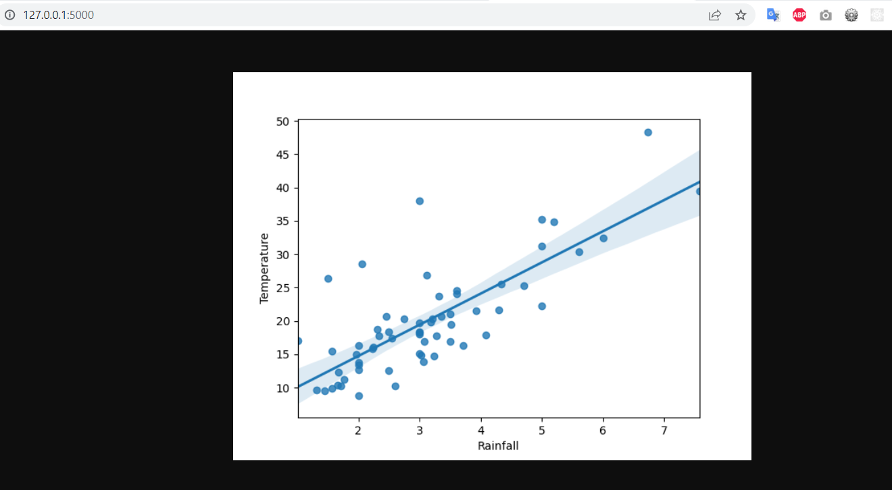

# Flask plot regression app

Dockerized flask app showing regression plot image.  

Dockerfile  
```Dockerfile
FROM python:3.8

COPY ./requirements.txt /requirements.txt

WORKDIR /

RUN pip3 install -r requirements.txt

COPY . /

EXPOSE 5000

ENTRYPOINT ["python3"]

CMD [ "app/app.py" ]
```

Building the image  
`docker build --tag flask-plotting-app .`  

Running the container:  
`docker run -it --name flaskpltapp -p 5000:5000 flask-plotting-app:latest`  

Final result:  
 

